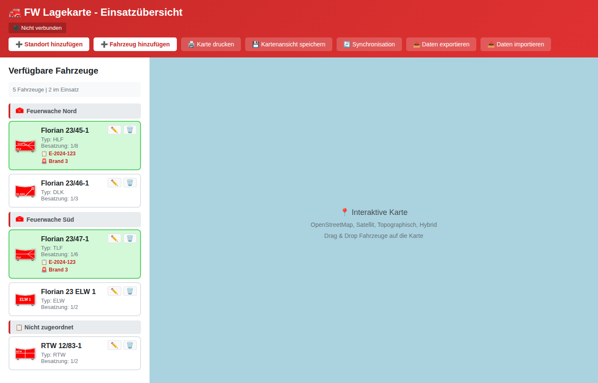
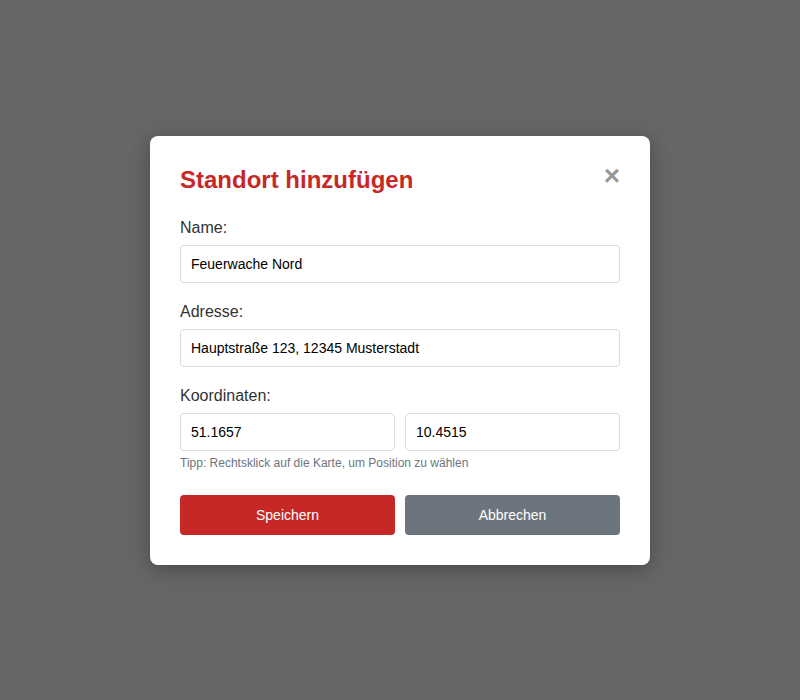
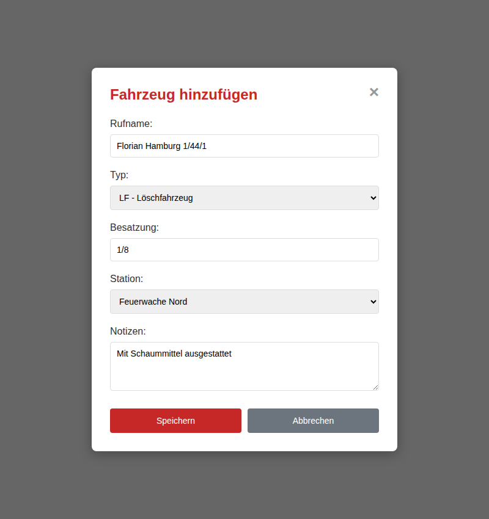

# FW Lagekarte - Einsatz-Lagekarte für Großeinsätze

Eine Desktop-Anwendung zur visuellen Verwaltung von Feuerwehr-Einsatzlagen mit interaktiver Karte, Fahrzeugverwaltung und Multi-User-Synchronisation.



## 📋 Inhaltsverzeichnis

- [Überblick](#überblick)
- [Funktionen](#funktionen)
- [Installation](#installation)
- [Schnellstart](#schnellstart)
- [Dokumentation](#dokumentation)
- [Technologie](#technologie)
- [Lizenz](#lizenz)

## Überblick

**FW Lagekarte** ist eine Electron-basierte Desktop-Anwendung zur Visualisierung und Verwaltung von Einsatzlagen bei Feuerwehr-Großeinsätzen. Die Anwendung ermöglicht die Darstellung von Standorten, Fahrzeugen und Einsatzkräften auf einer interaktiven OpenStreetMap-Karte.

### Hauptmerkmale

- 🗺️ **Interaktive Kartendarstellung** - OpenStreetMap mit verschiedenen Kartenansichten
- 🚒 **Fahrzeugverwaltung** - Verwaltung aller Einsatzfahrzeuge mit taktischen Zeichen
- 🏢 **Standortverwaltung** - Feuerwachen und Einsatzstellen markieren
- 🎯 **Drag & Drop** - Intuitive Bedienung per Maus
- 💾 **Offline-Fähig** - Funktioniert vollständig ohne Internetverbindung
- 🔄 **Multi-User-Synchronisation** - Echtzeit-Synchronisation über integriertem Server
- 🌐 **Web Viewer** - Schreibgeschützter Browser-Zugriff für Displays
- 🖨️ **Druckfunktion** - Professionelle Druckausgabe mit Legende
- 💻 **Plattformübergreifend** - Windows, Linux und macOS

## Funktionen

### Kartendarstellung und Navigation

- **Mehrere Karten-Layer**: OpenStreetMap (Standard), Satellit, Topographisch, Hybrid
- **Zoom und Pan**: Intuitive Navigation mit Maus und Tastatur
- **Speicherbare Ansicht**: Kartenausschnitt und Zoom-Level werden gespeichert
- **Offline-Karten**: Bereits angesehene Bereiche werden gecacht

### Standortverwaltung

- **Feuerwehr-Standorte**: Wachen, Gerätehäuser und andere Standorte markieren
- **Einsatzstellen**: Einsatzorte auf der Karte markieren
- **Kontextmenü**: Rechtsklick auf Karte zum schnellen Hinzufügen
- **Details**: Name, Adresse und GPS-Koordinaten

### Fahrzeugverwaltung

- **Umfassende Fahrzeugtypen**: HLF, LF, DLK, TLF, RW, ELW, MTW, KTW, RTW, NEF und mehr
- **Taktische Zeichen**: Automatische Darstellung nach FwDV 100
- **Besatzungsstärke**: Erfassung der aktuellen Besatzung
- **Standortzuordnung**: Fahrzeuge können Standorten zugeordnet werden
- **Notizen**: Zusätzliche Informationen zu Fahrzeugen

### Einsatzdarstellung

- **Drag & Drop**: Fahrzeuge per Drag & Drop auf Karte platzieren
- **Verschieben**: Fahrzeuge auf Karte frei bewegen
- **Status-Anzeige**: Verfügbare vs. eingesetzte Fahrzeuge
- **Seitenleiste**: Übersicht über verfügbare und eingesetzte Fahrzeuge
- **Gruppierung**: Fahrzeuge werden nach Standorten gruppiert

### Multi-User-Funktionalität

- **Integrierter Server**: WebSocket + HTTP Server direkt in der App
- **Echtzeit-Synchronisation**: Alle Änderungen werden sofort synchronisiert
- **Client-Modus**: Verbindung zu Server-Instanz
- **Web Viewer**: Read-Only Browser-Zugriff ohne Installation
- **Netzwerk-Erkennung**: Automatische Anzeige aller Netzwerk-IPs

### Import/Export

- **Datenexport**: Backup als JSON-Datei
- **Datenimport**: Wiederherstellung aus Backup
- **Portabilität**: Daten zwischen Installationen übertragen

## Installation

### Vorgefertigte Installer (Empfohlen)

Die einfachste Methode ist der Download eines fertigen Installers von den [GitHub Releases](https://github.com/TimUx/fw-lagekarte/releases):

#### Windows
- **`FW-Lagekarte-Setup-X.X.X.exe`** - NSIS Installer
- Installiert die Anwendung im Programme-Verzeichnis
- Erstellt Desktop-Verknüpfung und Startmenü-Eintrag

**Hinweis**: Bei der ersten Ausführung kann eine Windows SmartScreen-Warnung erscheinen. Siehe [Benutzerhandbuch - SmartScreen-Warnung](BENUTZERHANDBUCH.md#windows-smartscreen-warnung-umgehen).

#### Linux
- **`FW-Lagekarte-X.X.X.AppImage`** - Portable AppImage-Datei
  - Ausführbar machen: `chmod +x FW-Lagekarte-*.AppImage`
  - Starten: `./FW-Lagekarte-*.AppImage`
- **`fw-lagekarte_X.X.X_amd64.deb`** - Debian/Ubuntu Paket
  - Installieren: `sudo dpkg -i fw-lagekarte_*.deb`

#### macOS
- **`FW-Lagekarte-X.X.X.dmg`** - DMG Installer
- DMG öffnen und Anwendung in Programme-Ordner ziehen

### Entwicklung und Build

#### Voraussetzungen
- Node.js (v16 oder höher)
- npm

#### Anwendung starten

```bash
# Repository klonen
git clone https://github.com/TimUx/fw-lagekarte.git
cd fw-lagekarte

# Abhängigkeiten installieren
npm install

# Anwendung starten
npm start
```

#### Installer erstellen

```bash
# Alle Plattformen
npm run build

# Nur Windows
npm run build:win

# Nur Linux (AppImage + .deb)
npm run build:linux

# Nur macOS
npm run build:mac
```

Die Installer werden im `dist/`-Verzeichnis erstellt.

## Schnellstart

### 1. Standort hinzufügen



1. Klicken Sie auf **"➕ Standort hinzufügen"**
2. Geben Sie Name und Adresse ein
3. Klicken Sie auf die Karte, um die Position zu markieren
4. Klicken Sie auf **"Speichern"**

### 2. Fahrzeug hinzufügen



1. Klicken Sie auf **"➕ Fahrzeug hinzufügen"**
2. Geben Sie Rufname ein (z.B. "Florian Hamburg 1/44/1")
3. Wählen Sie den Fahrzeugtyp (LF, HLF, DLK, etc.)
4. Geben Sie die Besatzung ein (z.B. "1/8")
5. Optional: Wählen Sie einen zugeordneten Standort
6. Klicken Sie auf **"Speichern"**

### 3. Fahrzeug einsetzen

1. **Ziehen** Sie ein Fahrzeug aus der linken Seitenleiste
2. **Lassen** Sie es an der gewünschten Position auf der Karte fallen
3. Das Fahrzeug wird nun auf der Karte angezeigt und als "im Einsatz" markiert

### 4. Multi-User-Modus aktivieren (Optional)

**Server starten:**
1. Klicken Sie auf **"🔄 Synchronisation"**
2. Wählen Sie **"Server (Synchronisation bereitstellen)"**
3. Optional: Ändern Sie den Port (Standard: 8080)
4. Klicken Sie auf **"Speichern"**

**Client verbinden:**
1. Öffnen Sie FW Lagekarte auf einem anderen Computer
2. Klicken Sie auf **"🔄 Synchronisation"**
3. Wählen Sie **"Client (Zum Server verbinden)"**
4. Geben Sie die WebSocket-URL ein (z.B. `ws://192.168.1.100:8080`)
5. Klicken Sie auf **"Speichern"**

**Web Viewer öffnen:**
- Öffnen Sie einen Browser
- Geben Sie die HTTP-URL ein (z.B. `http://192.168.1.100:8080`)
- Der schreibgeschützte Viewer wird angezeigt

## Dokumentation

- **[README.md](README.md)** - Diese Datei (Übersicht und Installation)
- **[QUICKSTART.md](QUICKSTART.md)** - Schnelleinstieg für neue Benutzer
- **[BENUTZERHANDBUCH.md](BENUTZERHANDBUCH.md)** - Ausführliche Bedienungsanleitung
- **[FEATURES.md](FEATURES.md)** - Detaillierte Feature-Liste und technische Details
- **[ARCHITEKTUR.md](ARCHITEKTUR.md)** - Technische Architektur und Entwicklerdokumentation

## Technologie

### Frontend
- **Electron 39.x** - Desktop-Framework für plattformübergreifende Apps
- **Leaflet.js 1.9.x** - Interaktive Kartenvisualisierung
- **OpenStreetMap** - Freie Kartendaten und Tiles
- **LocalForage 1.10.x** - Lokale Datenspeicherung (IndexedDB)

### Backend (Embedded Server)
- **WebSocket (ws 8.x)** - Echtzeit-Synchronisation
- **Express 4.x** - HTTP-Server für Web Viewer
- **Node.js** - JavaScript-Runtime

### Build und Deployment
- **Electron Builder 26.x** - Erstellung plattformspezifischer Installer
- **NSIS** - Windows-Installer
- **AppImage & .deb** - Linux-Installer
- **DMG** - macOS-Installer

## Lizenz

ISC License - Siehe [LICENSE](LICENSE) Datei für Details.

## Support und Beiträge

- **Bugs und Feature-Requests**: [GitHub Issues](https://github.com/TimUx/fw-lagekarte/issues)
- **Fragen**: Erstellen Sie eine [Discussion](https://github.com/TimUx/fw-lagekarte/discussions)
- **Beiträge**: Pull Requests sind willkommen!

---

**Entwickelt für Feuerwehren und Rettungsdienste - Open Source und kostenlos** 🚒🚨
